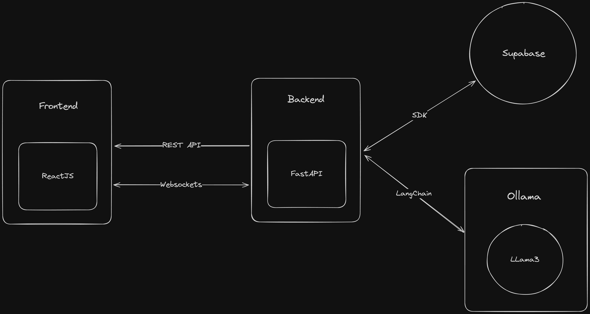

# Moody LLM

Moody LLM is an interactive chat application where a Language Model's mood keeps changing, allowing users to receive varied responses based on the LLM's current mood. The project is designed to simulate conversations with a moody AI, providing a unique and dynamic user experience.

## Overview



## Demo

<video controls src="https://moody-llm.s3.ap-south-1.amazonaws.com/demo.mp4" title="Demo"></video>

## Getting Started

### Prerequisites:

1. [Supabase](https://supabase.com/) Account:
    - Create an account on Supabase and set up a table.
    - Obtain the Supabase Key and Supabase URL from the Supabase dashboard.
    - Configure these details in the backend `.env` file.
    
    **Table Schema:**
    ```sql
    id UUID PRIMARY KEY
    created_at TIMESTAMPZ NOT NULL
    user_id UUID NOT NULL
    message JSON NOT NULL
    ```

2. Ollama Installation:
    - [Install](https://ollama.com/download) Ollama on your system.
    - Once installed, Do the following:
        * Run the command `ollama serve` to start the ollama server.
        * In the new tab run, `ollama pull llama3` to pull the llama3 model in your system.

### Steps:
- Clone the project repository to your local machine.
- **Backend:**
    - Navigate to the backend folder.
    - Install requirements: `pip install -r requirements.txt`
    - Run the backend services: `fastapi run dev`

    Access backend services at: http://localhost:8000/

- **Frontend:**
    - Navigate to the frontend folder.
    - Install libraries: `npm install`
    - Run the frontend app: `npm run dev`

    Access the frontend app at: http://localhost:5173/
